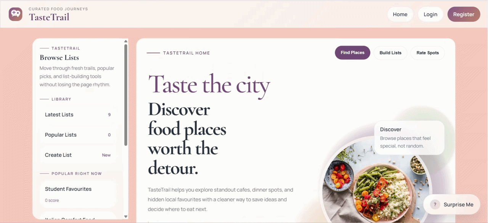
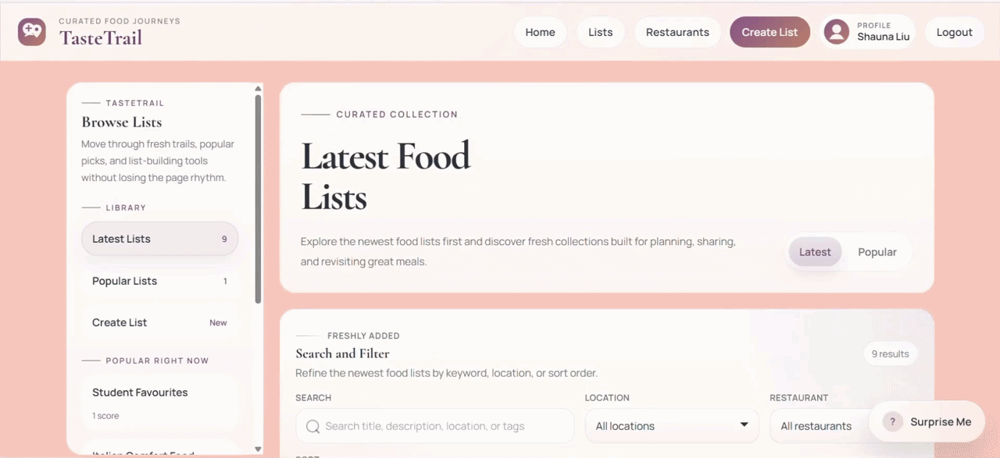

# TasteTrail – Food List Web Application


## 🍴 About TasteTrail
**TasteTrail** is a web application designed to help users discover restaurant and food recommendations through curated lists created by other users. Instead of focusing only on individual restaurant reviews, this platform focuses on list-based discovery, where users can create themed collections of restaurant recommendations.  
These lists allow users to share curated food experiences, making it easier for others to quickly find recommendations that match their taste. 


## 🍜 Discover Restaurants
Many existing food platforms focus on reviewing individual restaurants, while being useful this can often require users to find grouped recommendations tailored to particular preferences. TasteTrail solves this problem by allowing users to browse lists of restaurant recommendations organised by themes and tags. It allows users to create and customise their own collections of restaurant recommendations.



## ✨ Features
- User authentication (register and login)
- CRUD functionality for creating, editing, and deleting lists
- Ability to add restaurants or places to lists
- Public feed where users can browse and scroll through lists
- Tag system to categorise lists (e.g. spicy, sweet, budget)
- Upvote and downvote system to rank lists
- Form validation and error handling
- Viewing individual list pages with restaurant details

# ⚙️ Installation

This project is developed with Laravel. Follow the installation guide below to install and set up this website.

### 1. Clone the repo

```
git clone https://github.com/Adhira216/Server_Side_Development_CA2
```

### 2. Go to the project folder

```
cd Server_Side_Development_CA2
```

### 3. Install the initial dependencies from Composer

```
composer install
```

### 4. Install NPM dependencies

```
npm install
```

### 5. Create a copy of .env.example

`.env` files are not committed to this repo for security purposes, but there's a `.env.example` file that you can use as a base.

```
cp .env.example .env
```

### 6. Update your constants inside `.env`

`DB_HOST`, `DB_PORT`, `DB_DATABASE`, `DB_USERNAME` and `DB_PASSWORD`<br>
Update these constants to make sure they're matching your credentials

### 7. Generate the encryption key if needed

```
php artisan key:generate
```

### 8. Create a new empty database

This project is using MySQL.  
**Open your DBMS and create a database called** `ssd_ca2`.  
You can check the migrations to see all the tables that will be created.

### 9. Migrate the database

```
php artisan migrate:fresh --seed
```

### 10. Run the server
```
php artisan serve
```
**Visit:**
```
http://127.0.0.1:8000
```
Make sure your MySQL database server is running at the same time (e.g. XAMPP, MAMP), otherwise the application will not be able to connect to the database.
